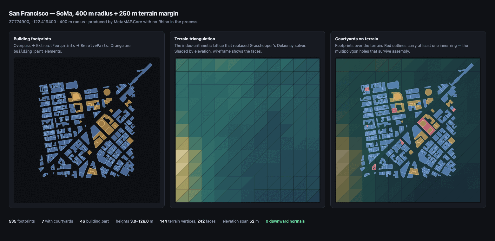

# MetaMAP

MetaMAP is a [Grasshopper](https://www.grasshopper3d.com/) plugin for Rhino that fetches and
processes geospatial data from OpenStreetMap and other sources. It builds 3D models of buildings
and terrain for architectural and urban planning work.

## Install

1. Run `_PackageManager` in Rhino, search for **MetaMAP**, install it, and restart Rhino.
2. Open Grasshopper. The components appear under the **MetaMAP** tab.

Requires [Rhino 8.27 or later](https://www.rhino3d.com/) (Windows or macOS) with Grasshopper.
MetaMAP is a `net8.0` assembly, and Rhino releases before 8.27 host plug-ins on .NET 7, which
cannot load it.

## Quick start

1. Drop a `MetaFETCH` component and pick a location on the map.
2. Wire its `Latitude` / `Longitude` outputs into `MetaBuilding` and `MetaTERRAIN`.
3. Connect `MetaTERRAIN`'s `Terrain Mesh` output to `MetaBuilding`'s `Terrain Mesh` input.
4. Set `Radius` and the other parameters, then flip `Run` to `True`.

Or right-click `MetaTEMPLATE` and insert a ready-made definition that already has all of this
wired up.

## Components

| Component | What it does |
| --- | --- |
| [MetaFETCH](docs/components.md#metafetch) | Interactive map to pick a location and read back its coordinates |
| [MetaBuilding](docs/components.md#metabuilding) | Building footprints and closed solids from OpenStreetMap, incl. multipolygons and `building:part` |
| [MetaBuildingAdvanced](docs/components.md#metabuildingadvanced) | Building solids from a global LoD1 WFS, tiled for large areas |
| [MetaTERRAIN](docs/components.md#metaterrain) | Triangulated terrain mesh from Open-Meteo / Open-Elevation / OSM contours |
| [MetaTEMPLATE](docs/components.md#metatemplate) | Inserts a ready-made definition into the canvas |
| [MetaUPDATE](docs/components.md#metaupdate) | Checks Yak for a newer published version |

Full inputs, outputs and behaviour: **[docs/components.md](docs/components.md)**.

## Documentation

- [Component reference](docs/components.md) — every input and output, and what it does
- [Troubleshooting](docs/troubleshooting.md) — map window, Overpass failures, template menu
- [Building from source](docs/development.md) — build, tests, CI and packaging
- [Releasing](RELEASE.md) — version bump, tag, and automatic Yak publishing
- [Renders](docs/renders/README.md) — Rhino-free renders and what they verify

## License

MetaMAP is free software licensed under the
[GNU General Public License v3.0 or later](LICENSE.md). It comes with no warranty.
Redistributions and derived works must also be GPL-3.0-or-later and must make their source
available.

## Disclaimer

This plugin relies on external APIs such as OpenStreetMap, Open-Meteo and Open-Elevation. The
availability and reliability of these services may vary. Please use this tool responsibly and
respect the terms of use of the respective data providers.
